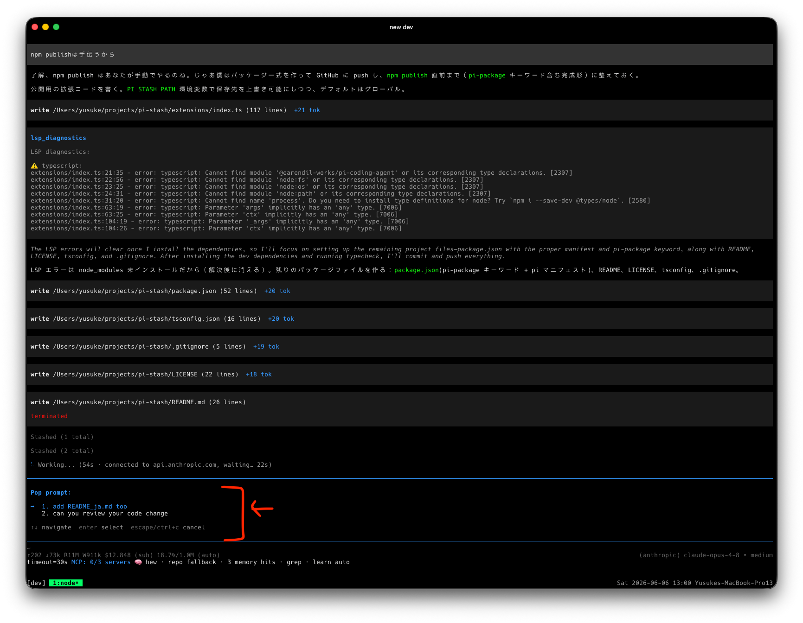

# pi-stash

A per-session stash of reusable prompt fragments for the [Pi coding agent](https://pi.dev).

Jot a prompt down whenever you think of it mid-task, then pop it into the editor
when you actually need it. Think of it as a stack-like scratchpad for prompts —
the ad-hoc, mutable companion to static prompt templates.



## Why

You're deep in a task and a thought hits you: *"oh, I should also have it rename
that module"* or *"remember to ask for tests after this."*

What do you do with that thought right now?

- **Queue it as a follow-up?** Too eager — follow-ups fire automatically the
  moment the current turn ends, whether or not you're ready, and in an order you
  don't fully control.
- **Keep it in your head?** You'll forget it the second the agent comes back
  with something interesting.
- **Paste it into a scratch file?** Now you're juggling another window.

Sometimes you just want to **park a prompt somewhere** and then **pull it out
whenever you feel like it** — on your own timing, by hand. Not auto-run, not
queued the instant the turn ends, just stashed and waiting until *you* decide
it's time.

That's the whole point of `pi-stash`:

- **Push** the thought the moment it strikes, so you don't lose it or break flow.
- **Pop** it back into the editor at exactly the moment you want it — not a
  second sooner.
- **Pick any one, in any order.** Your stash is a menu, not a queue. Pop the
  third thing first, skip the rest, come back for them later — follow-ups can't
  do that.

You stay in control of *what* gets said, *when*, and *in what order*.

## Install

```bash
pi install npm:@yusukeshib/pi-stash
```

## Commands

| Command | Action |
|---------|--------|
| `/stash <text>` | **Push** — save the given text onto the stash. |
| `/stash` | **Pop** — pick a saved entry, insert it into the editor, and remove it from the stash. Run repeatedly to stack several fragments together. |
| `/stash-clear` | Delete every stashed entry in this session (with confirm). |

While the stash is non-empty, a red `stash:N` badge is shown in the footer so
you never forget you have prompts parked.

## How it works

`pi-stash` is not a set of predefined `/name` templates. It is a backlog you
build up by hand during real work:

1. While working, you think "I should also ask it to update the docs" — instead
   of derailing now, run `/stash update the docs and changelog`.
2. Later, when you're ready, run `/stash`, pick that entry, and it drops into
   the editor. The entry is popped (removed) so the stash stays current.
3. Pop multiple entries in a row to compose a larger prompt from fragments.

## Storage

Entries are stored **inside the session itself** as custom session entries —
each Pi session has its own independent stash. It survives restarts and
`/resume`, and follows branching (`/fork`, `/clone`) correctly: a forked
session sees the stash as it was at the fork point.

Nothing is written outside the session file, and the stash does not
participate in the LLM context.

## License

MIT © yusukeshib
